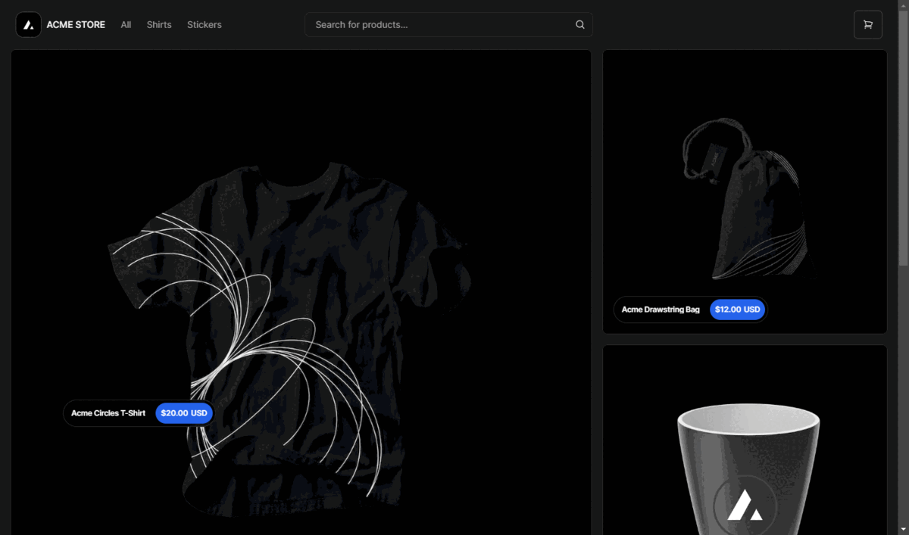

# Umbraco Vercel Commerce Demo 🦄

The Umbraco Vercel Commerce Demo is an implementation of the official [Vercel Commerce demo](https://github.com/vercel/commerce) backed by Umbraco using the Content Delivery API and Umbraco Storefront API.



## Getting Started

This demo is split into two parts, an Umbraco backend and the Vercel Commerce frontend. You can access the two parts within their relevant git branches. Given these are two distinct sub projects, it's best to checkout out each branch into a different folder independantly rather than checking out this main branch and switching between them.

```bash
git clone --branch backend/main https://github.com/umbraco/Umbraco.VercelCommerce.Demo.git backend
git clone --branch frontend/main https://github.com/umbraco/Umbraco.VercelCommerce.Demo.git frontend

```

For details on getting started with each part, view the README's in the respective branches

* [Getting Started - Backend](https://github.com/umbraco/Umbraco.VercelCommerce.Demo/tree/backend/main/README.md)
* [Getting Started - Frontend](https://github.com/umbraco/Umbraco.VercelCommerce.Demo/tree/frontend/main/README.md)

## License

Source code copyright © 2023 Umbraco A/S & Vercel, Inc.

All source code is licensed under MIT. The core Umbraco products are licensed under Umbracos commercial license.